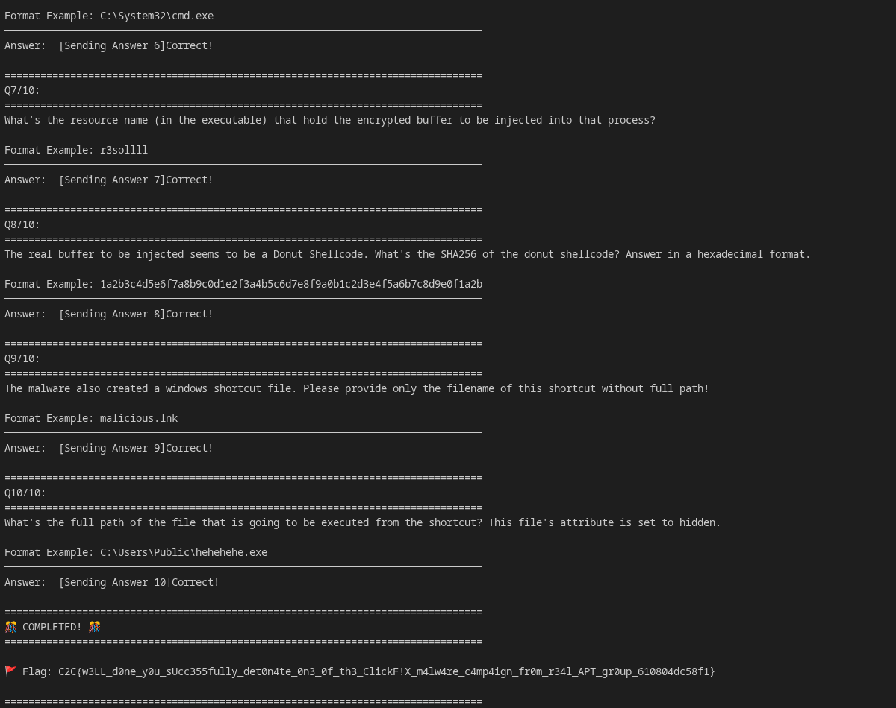

# FixClicked - Forensics

## Methodology
* **Vulnerability:** **Malware Analysis (ClickFix/ClearFake Campaign).** The infection vector was a social engineering attack where the user was tricked into copying and pasting a malicious PowerShell script to "fix" a browser issue.
* **Steps:**
    1.  **Any Run Analysis:** Analyzed the ANY.RUN report, this got me through the first few questions.
    2.  **Malware Analysis:** Downloaded the `trusteddevice.info` malware file from Any Run and did further local analysis.

## AI Usage

* **Did you use AI?** Claude Opus 4.6 aided with local analysis.

## Submission Script

```python
import socket, re, time

HOST, PORT = 'challenges.1pc.tf', 44523
ANSWERS = {
    1: 'trusteddevice.info', 
    2: 'ThsBFKNQuLtnyKgwB',
    3: 'f51cc3647d327a42d7f8d0a0c2b2a5118e220b79d4bb07ec5254482d23ad6984_83aa671706ae267d8f28b1dee7eb073e',
    4: 'd2bb7e2aeff5cbab17469afcd400104203628d4a074bf7e81b093f1a3ceca696',
    5: 'AzeroFloid', 
    6: r'C:\Windows\SysWOW64\explorer.exe',
    7: '65dbe5312fe14ca7b0ffeeb83ab519b6',
    8: '2ea6d67bfb58b50e3467e07a5e3461f6ade82ef4c960cc63369f8049f5775f62',
    9: 'App.url', 
    10: r'C:\Windows\Temp\Kvlk095\exp.exe'
}

with socket.socket(socket.AF_INET, socket.SOCK_STREAM) as s:
    s.connect((HOST, PORT))
    buf = ""
    print(f"[*] Connected to {HOST}:{PORT}")
    
    while True:
        try:
            data = s.recv(4096).decode(errors='ignore')
            if not data: break
            print(data, end="")
            buf += data

            match = re.search(r'Q(\d+)/10', buf)
            if match:
                q_num = int(match.group(1))
                if q_num in ANSWERS:
                    print(f" [Sending Answer {q_num}]", end="")
                    s.sendall((ANSWERS[q_num] + "\n").encode())
                    buf = "" # Clear buffer to wait for next question
                    time.sleep(0.5)
        except KeyboardInterrupt:
            break
```

## 🚩 Proof



# Conversation

```md
[*] Connected to challenges.1pc.tf:44523
================================================================================
Analyze the traffic, malicious script and uncover the attack chain!

================================================================================

Please answer the following questions:


================================================================================
Q1/10:
================================================================================
Judging from the traffic, it looks like the victim copied the powershell command to their terminal. What's the domain that preserve the malicious powershell script?

Format Example: evil.com
────────────────────────────────────────────────────────────────────────────────
Answer:  [Sending Answer 1]Correct!

================================================================================
Q2/10:
================================================================================
It looks like the malicious powershell script is run silently without showing the console windows. What's the function name that responsible to do it?

Format Example: Perlganteng
────────────────────────────────────────────────────────────────────────────────
Answer:  [Sending Answer 2]Correct!

================================================================================
Q3/10:
================================================================================
The malicious powershell script also does perform a self-decryption from an encrypted buffer from $OYBwgNyGIBxTBIKUL variable. What are the key and iv used during that process respectively? Wrap both components in hexadecimal format and underscore!

Format Example: b0b0722b8c59f4d07f50bcbe6f1c787ceff42ba07c23e94f23019682a15e746a_bf9e133ea7d6a7a7f0a623dcaefca976
────────────────────────────────────────────────────────────────────────────────
Answer:  [Sending Answer 3]Correct!

================================================================================
Q4/10:
================================================================================
Still referring with the previous question, what's the SHA256 of the decrypted buffer? Please do answer in hexadecimal format.

Format Example: a1b2c3d4e5f6a7b8c9d0e1f2a3b4c5d6e7f8a9b0c1d2e3f4a5b6c7d8e9f0a1b2
────────────────────────────────────────────────────────────────────────────────
Answer:  [Sending Answer 4]Correct!

================================================================================
Q5/10:
================================================================================
Diving to analyze the decrypted buffer which turns out to be an obfuscated executable, there can be spotted an uncompiled CSharp code which then later to be used for a potential process injection. What's the arbitrary function's name that responsible to perform this operation?

Format Example: InternationalBabadododt
────────────────────────────────────────────────────────────────────────────────
Answer:  [Sending Answer 5]Correct!

================================================================================
Q6/10:
================================================================================
What's the built-in main target process path executable that the code is trying to inject to? Provide the full path!

Format Example: C:\System32\cmd.exe
────────────────────────────────────────────────────────────────────────────────
Answer:  [Sending Answer 6]Correct!

================================================================================
Q7/10:
================================================================================
What's the resource name (in the executable) that hold the encrypted buffer to be injected into that process?

Format Example: r3sollll
────────────────────────────────────────────────────────────────────────────────
Answer:  [Sending Answer 7]Correct!

================================================================================
Q8/10:
================================================================================
The real buffer to be injected seems to be a Donut Shellcode. What's the SHA256 of the donut shellcode? Answer in a hexadecimal format.

Format Example: 1a2b3c4d5e6f7a8b9c0d1e2f3a4b5c6d7e8f9a0b1c2d3e4f5a6b7c8d9e0f1a2b
────────────────────────────────────────────────────────────────────────────────
Answer:  [Sending Answer 8]Correct!

================================================================================
Q9/10:
================================================================================
The malware also created a windows shortcut file. Please provide only the filename of this shortcut without full path!

Format Example: malicious.lnk
────────────────────────────────────────────────────────────────────────────────
Answer:  [Sending Answer 9]Correct!

================================================================================
Q10/10:
================================================================================
What's the full path of the file that is going to be executed from the shortcut? This file's attribute is set to hidden.

Format Example: C:\Users\Public\hehehehe.exe
────────────────────────────────────────────────────────────────────────────────
Answer:  [Sending Answer 10]Correct!

================================================================================
🎊 COMPLETED! 🎊
================================================================================

🚩 Flag: C2C{w3LL_d0ne_y0u_sUcc355fully_det0n4te_0n3_0f_th3_ClickF!X_m4lw4re_c4mp4ign_fr0m_r34l_APT_gr0up_610804dc58f1}

================================================================================
```

**Flag:** C2C{w3LL_d0ne_y0u_sUcc355fully_det0n4te_0n3_0f_th3_ClickF!X_m4lw4re_c4mp4ign_fr0m_r34l_APT_gr0up_610804dc58f1}