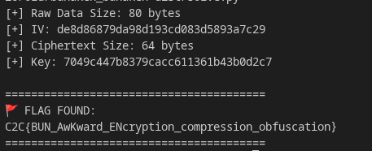

# bunaken - Reverse Engineering

## 📝 Methodology
* **Vulnerability:** Multi-layered obfuscation process combining binary analysis, JavaScript string decoding, and cryptographic operations.
* **Steps:**
    1.  Extract obfuscated JavaScript from the compiled Node.js binary using `strings`. Recovering password `sulawesi`
    2.  Claude analysed encryption technique and wrote a script to reverse it.

## Reproducibility (Code/Commands)
```python
import base64
import hashlib
from Crypto.Cipher import AES
import zstandard as zstd

ENCRYPTED_B64 = "3o2Gh52pjRk80IPViTp8KUly+kDGXo7qAlPo2Ff1+IOWW1ziNAoboyBZPX6R4JvNXZ4iWwc662Nv/rMPLdwrIb3D4tTbOg/vi0NKaPfToj0="
PASSWORD = "sulawesi"

def solve():
    try:
        # 1. Decode Base64 to get the raw binary (80 bytes)
        raw_data = base64.b64decode(ENCRYPTED_B64)
        
        # 2. Extract IV (First 16 bytes) and Ciphertext (The rest)
        iv = raw_data[:16]
        ciphertext = raw_data[16:]
        
        print(f"[+] Raw Data Size: {len(raw_data)} bytes")
        print(f"[+] IV: {iv.hex()}")
        print(f"[+] Ciphertext Size: {len(ciphertext)} bytes")

        # 3. Derive Key: SHA-256("sulawesi") -> First 16 bytes
        key = hashlib.sha256(PASSWORD.encode()).digest()[:16]
        print(f"[+] Key: {key.hex()}")

        # 4. Decrypt using AES-CBC
        cipher = AES.new(key, AES.MODE_CBC, iv)
        # We don't use unpad() because ZSTD handles its own boundaries
        decrypted_data = cipher.decrypt(ciphertext)

        # 5. Decompress the Zstandard payload
        # The decrypted data is a ZSTD archive. We decompress it directly.
        dctx = zstd.ZstdDecompressor()
        try:
            flag = dctx.decompress(decrypted_data)
            print("\n" + "="*40)
            print("🚩 FLAG FOUND:")
            print(flag.decode('utf-8', errors='ignore'))
            print("="*40)
        except zstd.ZstdError:
            reader = dctx.stream_reader(decrypted_data)
            flag = reader.read()
            print("\n" + "="*40)
            print("🚩 FLAG FOUND (Stream):")
            print(flag.decode('utf-8'))
            print("="*40)

    except Exception as e:
        print(f"[-] Error: {e}")

if __name__ == "__main__":
    solve()
```

## 🤖 AI Usage

* Did you use AI? Yes, Claude Opus 4.6 used for analysing the binary and reversing encryption.

## 🚩 Proof



Flag: C2C{BUN_AwKward_ENcryption_compression_obfuscation}
